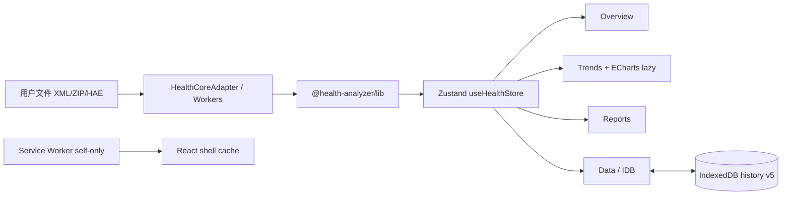

# Dual-track UI：legacy PWA + React Health OS 预览

本地优先、无 CDN、无埋点。分析内核仍是 `@health-analyzer/lib` / Workers / IndexedDB；React 只负责壳与交互。

| 项 | 值 |
|----|-----|
| **迁移 baseline tip** | `cb1685d`（v2.1 legacy） |
| **生产默认入口** | `web-ui/public/`（legacy PWA） |
| **React 预览包** | `web-ui/react-app/` |
| **同域可选挂载** | `web-ui/public/next/`（`npm run react:export-next`，**gitignore**） |
| **文档版本** | 双轨 **MVP 预览**（非可切主 v3）；P0 共享仓写入已禁用 |
| **定位** | 高完成度 React **预览版**，不是可安全替代 legacy 的生产架构 |

---

## 1. 双轨一览

```text
health-analyzer/
├─ lib/                      # 解析 / 统计 / 报告 / FHIR 内核（勿在 React 重写）
├─ web-ui/
│  ├─ public/                # ★ 生产默认：legacy PWA
│  │  ├─ index.html          # 「试用新版」→ ./next/
│  │  ├─ history-db.js       # IDB schema 权威
│  │  ├─ parse-worker.js …
│  │  └─ next/               # 可选：React 同域导出（构建产物，不入库）
│  └─ react-app/             # ★ React + Vite + TS 预览轨
│     ├─ src/core/           # Adapter / Worker / ZIP / HAE / IDB
│     ├─ src/pages/          # Overview · Trends · Reports · Data
│     └─ scripts/            # privacy-scan · export-next
├─ e2e/                      # legacy Playwright
└─ e2e-react/                # React Playwright（端口 4174）
```

| 路径 | 角色 |
|------|------|
| `web-ui/public/` | **默认部署目录**；smoke / e2e 门禁 |
| `web-ui/react-app/` | 现代壳源码；`npm run react:*` |
| `web-ui/react-app/dist/` | 独立 preview（`base=/`） |
| `web-ui/public/next/` | 同域 `/next/`（`base=/next/`，导出后可删） |

---

## 2. 脚本（仓库根 `health-analyzer/`）

```bash
# Legacy 门禁（生产轨）
npm run smoke
npm run test:e2e
npm run test:lib
npm run test:fhir          # 按需

# React 轨
npm run react:install      # web-ui/react-app 依赖
npm run react:dev          # Vite 开发服
npm run react:build        # → web-ui/react-app/dist
npm run react:preview      # 默认 127.0.0.1:4173
npm run react:test         # Vitest（adapter / IDB / ZIP / HAE / 仓…）
npm run react:parity       # 夹具 parity 子集
npm run react:privacy      # dist 隐私扫描（禁 CDN/分析域）
npm run react:export-next  # base=/next/ → public/next/，并恢复 dist 为 base=/
npm run test:e2e:react     # Playwright React 壳（build + preview :4174）
```

包内亦可：`cd web-ui/react-app && npm run dev|build|test|privacy|export-next`。

---

## 3. 同域双轨（`/next/`）

1. `npm run react:export-next`
2. 静态服务 **`web-ui/public`**（与线上一致）
3. 打开 `/`（legacy）或点顶栏 **「试用新版」** → `/next/`
4. React「关于」→ **返回 legacy**（`../`）

### 偏好键

`localStorage['ha-ui-shell'] = 'react' | 'legacy'`

- React 关于面板可写入。
- Legacy `index.html`：**仅当** 偏好为 `react` **且** `HEAD ./next/index.html` 成功时跳转（e2e 不设偏好，不误跳）。

### 回滚

删除 `web-ui/public/next/` 或清除偏好；生产根目录始终可只部署 `public/` 本体。

---

## 4. 已交付功能面

### 4.1 应用壳（阶段 3）

| 能力 | 实现 |
|------|------|
| 桌面侧栏 + 手机底栏 | `workspaceStore` 同源 `active` |
| 主题 light / dark / system | `ThemeProvider` + CSS 变量 |
| UI primitives | Button · Card · Badge · Sheet · Empty/Loading/Error |
| 无 CDN 字体 | 系统字体栈 |

### 4.2 四工作区（阶段 4）

| 页 | 行为 |
|----|------|
| **总览** | **状态带**（`StatusBand`）/ **信号列表**（`SignalList`）/ 新鲜度 / KPI；夹具；**XML / ZIP / HAE**；Worker；**加载/写入仓（sharded-v1）**；快照。路径：`web-ui/react-app/src/features/overview/StatusBand.tsx`、`SignalList.tsx` |
| **趋势** | **域切换器**（`domain-switcher` + `trend-domain-*`）+ 本地 **ECharts 懒加载** + 表回退（ECharts **不**进 SW 首装 precache） |
| **报告** | 门诊一页纸 / 周报 / 临床复盘 + 复制/下载 .md |
| **数据** | IDB 契约探测；快照列表；warehouseMeta 只读 |

### 4.3 导入与 I/O

| 路径 | 模块 | 说明 |
|------|------|------|
| XML | `HealthCoreAdapter.analyzeXml(Async)` | Worker：`analyze.worker.ts`，失败回退主线程 |
| ZIP | `zipImport.ts` + npm **fflate** | 选 `export.xml` / `导出.xml`；可选 ECG CSV |
| HAE | `haeImport.ts` → `mergeHaeIntoData` | JSON/CSV，可叠在当前 `HealthData` |
| 仓加载 | `warehouseLoad.ts` | consent；reassemble；`react-core-full-v1` **core-only** |
| 仓写入 | `warehousePersist.ts` + `warehouseShards.ts` | **sharded-v1** 全量替换（legacy 兼容） |
| 快照 | `snapshotWrite.ts` | `buildAnalysisSnapshot` → `snapshots` keep-30 |

### 4.4 隐私 / PWA（阶段 5）

- `vite-plugin-pwa`：壳层 precache only；**排除** echarts/TrendChart；无 source map；`registerType: 'prompt'`
- `scripts/privacy-scan.mjs`：禁 CDN/analytics 等
- ECharts 路由懒加载 + 非首装预缓存

### 4.5 内核边界与 IDB

- **禁止**在 React 重写 parse/stats/FHIR。
- IDB：`health-analyzer-history` **v5**；indexes 与 `history-db.js` 对齐（`idbContract.test.ts` 锁源码 + fake-indexeddb 内省）。
- React 写入时已做软配额多域 eviction（全链路）；**交互 keep-N / 硬配额面板仍 legacy**。

### 4.6 测试矩阵

| 命令 | 覆盖 |
|------|------|
| `npm run react:test` | Adapter parity、IDB schema、ZIP、HAE、仓 load/persist、快照、workspace |
| `npm run test:e2e:react` | 夹具/路由/Sheet、XML+ZIP、快照列表、HAE+仓往返（Chromium :4174） |
| `npm run smoke` / `test:e2e` | **Legacy 不回归** |

---

## 5. 源码地图（`web-ui/react-app/src`）

```text
core/
  HealthCoreAdapter.ts    # parse/analyze/report/series 边界
  analyze.worker.ts       # module Worker
  parseWorkerClient.ts
  zipImport.ts
  haeImport.ts
  idbContract.ts          # 契约 + empty-create
  legacyHistoryRead.ts    # 快照/meta 只读
  warehouseLoad.ts        # reassemble + analyze
  warehousePersist.ts     # core|full 写入
  snapshotWrite.ts
components/ui/            # 设计 primitives
components/charts/        # TrendChart（lazy echarts）
features/overview/        # StatusBand · SignalList（总览密度 MVP+）
pages/                    # Overview Trends Reports Data
stores/workspaceStore.ts
store/useHealthStore.ts
layout/AppShell.tsx
theme/ThemeProvider.tsx
styles/                   # CSS 变量 tokens（非 Tailwind 全量）
```

---

## 6. 架构示意



全程无后端、无登录、无云健康 API。

---

## 7. 提交里程碑（便于对照 git）

| Commit | 内容 |
|--------|------|
| `801cbb1` | React 壳 + adapter + privacy + 双轨文档初版 |
| `6367f07` | IDB empty schema 与 legacy indexes 对齐 |
| `cad4ade` | 阶段 3–6：侧栏/底栏、四工作区、ECharts、报告 |
| `cc0dbc9` | XML Worker、IDB 只读、`/next` export、偏好键 |
| `19a7ca7` | ZIP、仓加载、快照、`e2e-react` |
| `dd55e05` | HAE、仓写入、进度文案 |
| `8d9ca0a` | legacy 兼容 sharded-v1 仓写入（React） |
| `01cd038` | echarts tree-shake、CGM 软驱逐、总览密度初版 |
| `bf0c8b8` | BP/体重软驱逐、壳 i18n、总览 insight strip |
| `89b54a1` | 睡眠/步数软驱逐 + 数据仓页密度 |
| `846d680` | **软配额全链路**（CGM→BP/体重→睡眠/步数→HRV→训练/ECG/手表）写入时完成 |
| *(本提交)* | **总览状态带 / 信号列表 / 趋势 domain-switcher + 壳层会话 chip / Trends i18n**（MVP+ 密度） |

---

## 8. 定位、P0/P1 与非目标

**可宣布：** 现代双轨架构 **MVP / 预览** 完成。  
**不可宣布：** 架构升级项目完成、新版可替代旧版、可切默认生产入口。

| 项 | 状态 |
|----|------|
| Tailwind v4 / 全量 shadcn | **未上**；CSS 变量 + 自有 primitives |
| 生产默认 cutover 到 React | **未做** |
| 仓按月/年分片 + keep-N | **分片写入 React 已有**；交互 keep-N / 硬配额面板 **仅 legacy** |
| 高品质健康大屏 UI | **未做**（功能壳 + MVP+ 密度，非可编辑栅格） |
| HAE 未知指标落库 / CommandPalette | 未做 |

### P0 — 共享数据仓互通

| 问题（曾） | 仅写 `core\|full` 时，legacy 分片会覆盖 core → 混态。 |
|------|------|
| **当前写入** | `persistHealthDataSharded`：与 history-db 一致 **clear domainChunks + put 全量 sharded-v1 分片**（`warehouseShards.ts`）。 |
| **core-only 旧路径** | `persistHealthDataSimple` 仅 `force` 可测；产品 UI 不用。 |
| **读取** | `layout=sharded-v1` 或存在 domain 分片 → 合并分片；`react-core-full-v1` → core-only。 |
| **软配额** | 写入时全链路 **已做**（`846d680`）；**交互 keep-N UI 仍未做**（仍用 legacy 数据中心）。 |
| **仍缺** | 交互式 keep-N / 生产 cutover；真实「旧版写→React写→旧版读」浏览器交叉 E2E（单测已覆盖分片往返）。 |
| **生产建议** | 可试用 React 写仓（会**整仓替换**分片集）；大规模 keep-N 仍用 legacy 面板。 |

### P1 工程

| 项 | 状态 |
|----|------|
| ECharts 不进 SW 首装 precache | 壳层 JS 白名单 + ignore charts/components/axis… |
| 生产关闭 source map | `build.sourcemap: false` |
| SW 更新用户确认 | `registerType: 'prompt'` + `PwaUpdateBanner` |
| echarts/core 按需构建 | **已做**（Line + Grid + Tooltip + DataZoom） |
| 软配额全链路（CGM→BP/体重→睡眠/步数→HRV→训练/ECG/手表） | **已做**（写入时，`846d680`；**交互 keep-N 仍 legacy / 未做**） |
| 壳层 i18n 中/英 | **已做**（`ha-react-ui-locale`，导航/总览键） |
| 总览状态带 / 信号列表 / 趋势工作台密度 | **已合入（MVP+，`8055486`）**：`StatusBand` / `SignalList` / Trends `domain-switcher` + 壳层会话 chip / Trends 中英 i18n |
| 报告页 i18n + 数据页软配额只读面板 | **本轮**：Reports 中英键；`SoftQuotaPanel` 展示写入时淘汰顺序（交互 keep-N 仍 legacy） |
| 可编辑大屏栅格 / 手机完整单任务产品 | **未做** |


---

## 9. 相关文档

- 总览与上手：`README.md`、`docs/README.md`
- 手工 QA：`docs/MANUAL_QA.md`（含双轨检查项）
- 数据中心 / 分片权威：`docs/DATA_CENTER_v1.68.md`、`web-ui/public/history-db.js`
- 包内说明：`web-ui/react-app/README.md`
