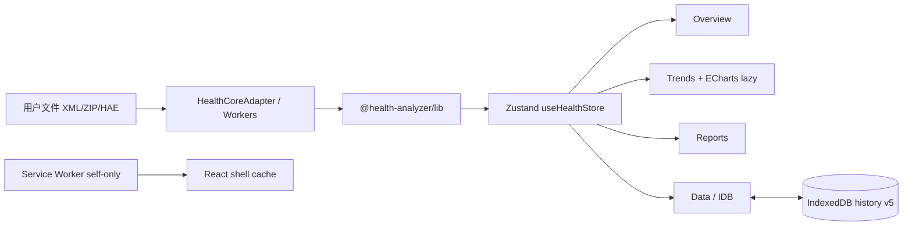

# Dual-track UI → Strategy A cutover（React 为默认）

本地优先、无 CDN、无埋点。分析内核仍是 `@health-analyzer/lib` / Workers / IndexedDB。

| 项 | 值 |
|----|-----|
| **生产默认入口** | **React 壳** 位于 `web-ui/public/` **根路径 `/`**（`npm run react:export-cutover`） |
| **旧版回滚** | `web-ui/public/legacy/` → 站点 **`/legacy/`** |
| **React 源码** | `web-ui/react-app/` |
| **废弃预览路径** | `/next/`（`react:export-next` 仅兼容保留，非产品路径） |
| **文档定位** | **新版替代旧版**；双轨是迁移期回滚，不是产品目标 |

---

## 1. 发布树一览

```text
web-ui/public/                 # 部署目录（wrangler / Pages）
├─ index.html, assets/, sw…    # React（cutover 构建产物，gitignore）
├─ CUTOVER_STAMP.txt
└─ legacy/                     # 旧版 PWA（源码入库）
   ├─ index.html · app.js · history-db.js …
   └─ 「返回新版」→ ../
web-ui/react-app/              # React 源码
```

| 路径 | 角色 |
|------|------|
| `/` | **默认产品入口**（React） |
| `/legacy/` | **回滚专用**旧版 PWA |
| `web-ui/react-app/` | 现代壳源码 |

---

## 2. 脚本

```bash
# 生产发布（必须）
npm run react:export-cutover   # base=/ → public 根 + 保留 public/legacy/

# 开发
npm run react:dev
npm run react:test
npm run react:privacy          # 对 react-app/dist 或 cutover 后 public 扫描

# 门禁
npm run smoke                  # legacy 树 +（若已 cutover）根 React 形态
npm run test:e2e               # 旧版 /legacy/
npm run test:e2e:react         # 默认根 React（cutover + serve）
npm run test:e2e:dual          # 仓互通：/ 与 /legacy/

# 废弃
npm run react:export-next      # 仅 /next/ 预览，勿作默认
```

---

## 3. 回滚

1. 打开 **`/legacy/`**
2. 可选：`localStorage['ha-ui-shell']='legacy'`（壳内按钮会跳转 `/legacy/`）
3. 数据：共享 IndexedDB `sharded-v1`，勿另起库

---

## 4. 已交付功能面（React 产品路径）

### 4.1 应用壳（阶段 3）

| 能力 | 实现 |
|------|------|
| 桌面侧栏 + 手机底栏 | `workspaceStore` 同源 `active` |
| 主题 light / dark / system | `ThemeProvider` + CSS 变量 |
| UI primitives | Button · Card · Badge · Sheet · Empty/Loading/Error |
| 无 CDN 字体 | 系统字体栈 |

### 4.2 四工作区（阶段 4）

| 页 | 行为 |
|----|------|
| **总览** | **状态带**（`StatusBand`）/ **信号列表**（`SignalList`）/ 新鲜度 / KPI；夹具；**XML / ZIP / HAE**；Worker；**加载/写入仓（sharded-v1）**；快照。路径：`web-ui/react-app/src/features/overview/StatusBand.tsx`、`SignalList.tsx` |
| **趋势** | **域切换器**（`domain-switcher` + `trend-domain-*`）+ 本地 **ECharts 懒加载** + 表回退（ECharts **不**进 SW 首装 precache） |
| **报告** | 门诊一页纸 / 周报 / 临床复盘 + 复制/下载 .md |
| **数据** | IDB 契约探测；快照列表；warehouseMeta 只读 |

### 4.3 导入与 I/O

| 路径 | 模块 | 说明 |
|------|------|------|
| XML | `HealthCoreAdapter.analyzeXml(Async)` | Worker：`analyze.worker.ts`，失败回退主线程 |
| ZIP | `zipImport.ts` + npm **fflate** | 选 `export.xml` / `导出.xml`；可选 ECG CSV |
| HAE | `haeImport.ts` → `mergeHaeIntoData` | JSON/CSV，可叠在当前 `HealthData` |
| 仓加载 | `warehouseLoad.ts` | consent；reassemble；`react-core-full-v1` **core-only** |
| 仓写入 | `warehousePersist.ts` + `warehouseShards.ts` | **sharded-v1** 全量替换（legacy 兼容） |
| 快照 | `snapshotWrite.ts` | `buildAnalysisSnapshot` → `snapshots` keep-30 |

### 4.4 隐私 / PWA（阶段 5）

- `vite-plugin-pwa`：壳层 precache only；**排除** echarts/TrendChart；无 source map；`registerType: 'prompt'`
- `scripts/privacy-scan.mjs`：禁 CDN/analytics 等
- ECharts 路由懒加载 + 非首装预缓存

### 4.5 内核边界与 IDB

- **禁止**在 React 重写 parse/stats/FHIR。
- IDB：`health-analyzer-history` **v5**；indexes 与 `history-db.js` 对齐（`idbContract.test.ts` 锁源码 + fake-indexeddb 内省）。
- React 写入时已做软配额多域 eviction（全链路）；**交互 keep-N / 硬配额面板仍 legacy**。

### 4.6 测试矩阵

| 命令 | 覆盖 |
|------|------|
| `npm run react:test` | Adapter parity、IDB schema、ZIP、HAE、仓 load/persist、快照、workspace |
| `npm run test:e2e:react` | 夹具/路由/Sheet、XML+ZIP、快照列表、HAE+仓往返（Chromium :4174） |
| `npm run test:e2e:dual` | **同域交叉 E2E 骨架**（A–B: React 写 sharded-v1 → legacy status + React `load-warehouse`；C: **legacy API 写 → React load-warehouse**；D: **legacy 写 → React 再持久化 → legacy status**；:4175） |
| `npm run smoke` / `test:e2e` | **Legacy 不回归** |

---

## 5. 源码地图（`web-ui/react-app/src`）

```text
core/
  HealthCoreAdapter.ts    # parse/analyze/report/series 边界
  analyze.worker.ts       # module Worker
  parseWorkerClient.ts
  zipImport.ts
  haeImport.ts
  idbContract.ts          # 契约 + empty-create
  legacyHistoryRead.ts    # 快照/meta 只读
  warehouseLoad.ts        # reassemble + analyze
  warehousePersist.ts     # core|full 写入
  snapshotWrite.ts
components/ui/            # 设计 primitives
components/charts/        # TrendChart（lazy echarts）
features/overview/        # StatusBand · SignalList（总览密度 MVP+）
features/data/            # SoftQuotaPanel · KeepNPanel
core/warehouseKeepPrefs.ts / warehouseKeepWindows.ts
pages/                    # Overview Trends Reports Data
stores/workspaceStore.ts
store/useHealthStore.ts
layout/AppShell.tsx
theme/ThemeProvider.tsx
styles/                   # CSS 变量 tokens（非 Tailwind 全量）
```

---

## 6. 架构示意



全程无后端、无登录、无云健康 API。

---

## 7. 提交里程碑（便于对照 git）

| Commit | 内容 |
|--------|------|
| `801cbb1` | React 壳 + adapter + privacy + 双轨文档初版 |
| `6367f07` | IDB empty schema 与 legacy indexes 对齐 |
| `cad4ade` | 阶段 3–6：侧栏/底栏、四工作区、ECharts、报告 |
| `cc0dbc9` | XML Worker、IDB 只读、`/next` export、偏好键 |
| `19a7ca7` | ZIP、仓加载、快照、`e2e-react` |
| `dd55e05` | HAE、仓写入、进度文案 |
| `8d9ca0a` | legacy 兼容 sharded-v1 仓写入（React） |
| `01cd038` | echarts tree-shake、CGM 软驱逐、总览密度初版 |
| `bf0c8b8` | BP/体重软驱逐、壳 i18n、总览 insight strip |
| `89b54a1` | 睡眠/步数软驱逐 + 数据仓页密度 |
| `846d680` | **软配额全链路**（CGM→BP/体重→睡眠/步数→HRV→训练/ECG/手表）写入时完成 |
| `8055486` | 总览状态带 / 信号列表 / 趋势 domain-switcher + 壳层会话 chip / Trends i18n |
| `5dcb9f6` | 报告 i18n + SoftQuotaPanel 只读 |
| `b958b6d` | keep-N 核心 + KeepNPanel + 总览工具栏主/次折叠 |
| `fcace80` | 同域交叉 e2e 骨架 + 总览 KPI 折叠 + 数据页 i18n |
| `936ed79` | dual C legacy→React + Trends sleep/HRV + Alt+1–4 工作区快捷键 |
| *(本提交)* | **dual D 往返 + KPI 显隐 prefs + KPI→Trends 深链** |

---

## 8. 定位、P0/P1 与非目标

**可宣布：** 生产默认入口为 **React `/`**；旧版仅 **`/legacy/` 回滚**。  
**不可宣布：** 与 `app.js` 100% 功能 parity、可删掉 legacy 源码、架构升级「全部完成」。

| 项 | 状态 |
|----|------|
| 生产默认 cutover 到 React 根路径 | **已做**（`react:export-cutover`） |
| Tailwind v4 / 全量 shadcn | **未上**；CSS 变量 + 自有 primitives |
| 仓按月/年分片 + keep-N | React 有写入 + keep-N MVP；legacy 仍有更全多选删除 UI |
| 高品质健康大屏 UI | **未做**（非可编辑栅格） |
| 加密备份 UI 迁入 React | **未做**（仍可走 `/legacy/`） |

### P0 — 共享数据仓互通

| 问题（曾） | 仅写 `core\|full` 时，legacy 分片会覆盖 core → 混态。 |
|------|------|
| **当前写入** | `persistHealthDataSharded`：与 history-db 一致 **clear domainChunks + put 全量 sharded-v1 分片**。 |
| **读取** | `layout=sharded-v1` 或存在 domain 分片 → 合并分片。 |
| **交叉 E2E** | `test:e2e:dual`：`/` React ↔ `/legacy/`（A–D）。 |
| **后续** | React 产品 parity（备份、更全数据中心 UI）优先于再堆 dual 胶水。 |

### P1 工程

| 项 | 状态 |
|----|------|
| ECharts 不进 SW 首装 precache | 壳层 JS 白名单 + ignore charts/components/axis… |
| 生产关闭 source map | `build.sourcemap: false` |
| SW 更新用户确认 | `registerType: 'prompt'` + `PwaUpdateBanner` |
| echarts/core 按需构建 | **已做**（Line + Grid + Tooltip + DataZoom） |
| 软配额全链路（CGM→BP/体重→睡眠/步数→HRV→训练/ECG/手表） | **已做**（写入时，`846d680`） |
| 交互 keep-N（React） | **已做 MVP**：`warehouseKeepPrefs` / `warehouseKeepWindows` / `KeepNPanel`；auto-trim 默认关；与 legacy 共用 localStorage |
| 壳层 i18n 中/英 | **已做**（`ha-react-ui-locale`，导航/总览键） |
| 总览状态带 / 信号列表 / 趋势工作台密度 | **已合入**；工具栏折叠 + KPI/域折叠（默认展开） |
| 报告页 i18n + 数据页软配额/keep-N 面板 | **已做**；数据页文案 i18n **本轮** |
| 同域交叉仓 E2E | **骨架已有** `test:e2e:dual`（非全矩阵） |
| 可编辑大屏栅格 / 手机完整单任务产品 | **未做** |


---

## 9. 相关文档

- 总览与上手：`README.md`、`docs/README.md`
- 手工 QA：`docs/MANUAL_QA.md`（含双轨检查项）
- 数据中心 / 分片权威：`docs/DATA_CENTER_v1.68.md`、`web-ui/public/legacy/history-db.js`
- 包内说明：`web-ui/react-app/README.md`
